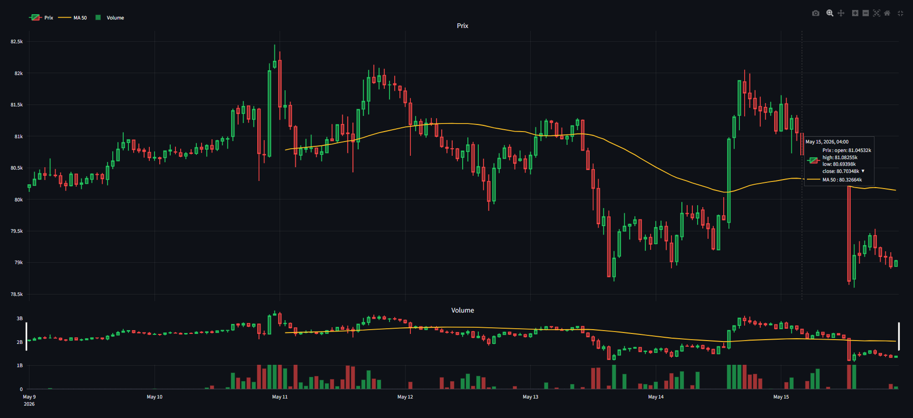
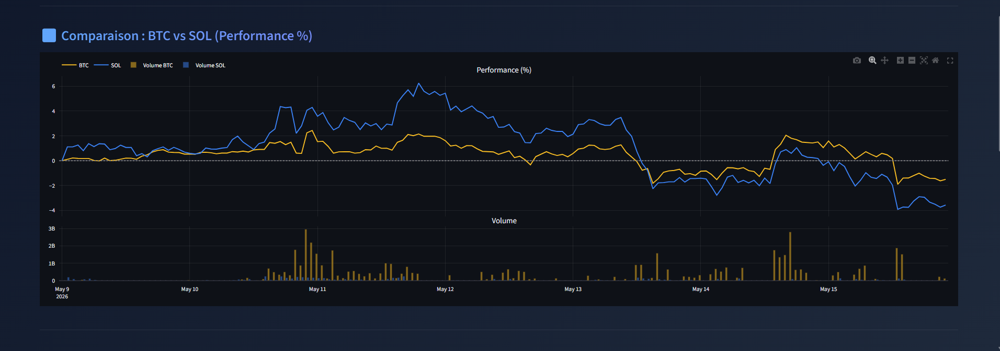
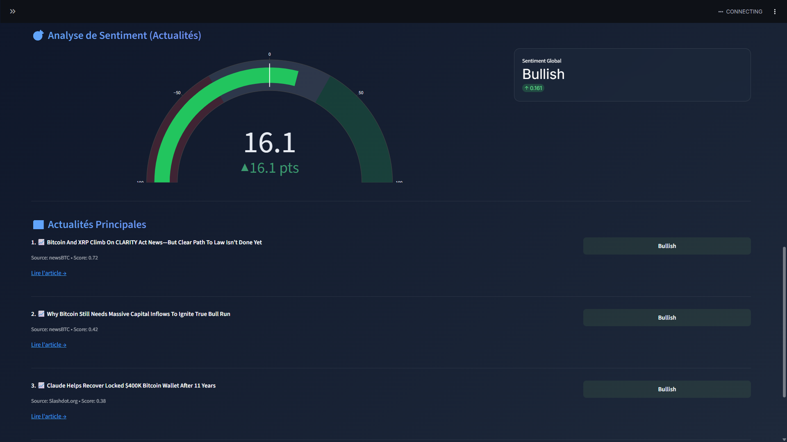
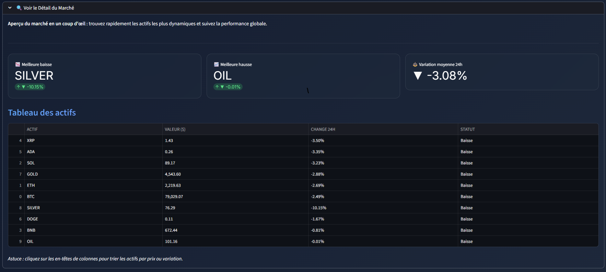

<p align="center">
  
</p>

# 🚀 Market Dashboard Pro

<div align="center">

[](https://github.com/aneschebbi6-star/Market_Dashbord)
[](https://www.python.org/)
[](https://streamlit.io/)
[](LICENSE)
[](https://github.com/psf/black)

</div>

**Market Dashboard Pro** est une plateforme **haute performance** d'analyse et de suivi de cryptomonnaies. Conçue avec **Python**, **Streamlit** et alimentée par des APIs financières de premier plan (Yahoo Finance, CoinGecko), elle offre une expérience utilisateur ultra-fluide et premium pour la gestion et l'analyse des actifs numériques en temps réel.

✨ **Idéal pour** : Traders, analystes quantitatifs, investisseurs et passionnés de finance décentralisée (DeFi).

---

## 📑 Table des Matières

- [✨ Caractéristiques Principales](#-caractéristiques-principales)
- [📸 Galerie de l'Interface](#-galerie-de-linterface)
- [🛠️ Installation & Configuration](#️-installation--configuration)
- [🚀 Lancement Rapide](#-lancement-rapide)
- [🧰 Stack Technique](#-stack-technique)
- [📂 Architecture du Projet](#-architecture-du-projet)
- [⚙️ Configuration Avancée](#️-configuration-avancée)
- [🔧 Troubleshooting & FAQ](#-troubleshooting--faq)
- [🛣️ Roadmap](#️-roadmap-à-venir)
- [🤝 Contribution](#-contribution)
- [📄 Licence](#-licence)

---

## ✨ Caractéristiques Principales

| 📊 **Analyse Avancée** | ⚡ **Temps Réel & Performance** | 🎨 **UI/UX Premium** |
| :--- | :--- | :--- |
| **Graphiques Interactifs** en chandeliers propulsés par Plotly. | **Données instantanées** pour BTC, ETH, SOL, et plus de 5000 actifs. | **Design Moderne** avec un thème sombre élégant et du *glassmorphism*. |
| **Indicateurs techniques** intégrés (MA50, MA200, Bandes de Bollinger). | **Système de Cache (Redis/Local)** pour des temps de chargement minimes. | **Animations fluides** et transitions cinétiques à l'interaction. |
| **Comparaison Multi-Actifs** jusqu'à 5 actifs en simultané. | **Recherche Globale Dynamique** ultra-réactive sur tout le marché mondial. | **Actualités financières intégrées** (via NewsAPI). |

---

## 📸 Galerie de l'Interface

> [!TIP]
> Pour une expérience visuelle et analytique optimale, utilisez l'application sur un navigateur moderne (Chrome, Edge, Safari) en mode plein écran.

### 📊 Tableau de Bord Principal
<div align="center">
  
</div>

### 📈 Analyse Graphique Avancée
<div align="center">
  
</div>

### 🔄 Comparaison Multi-Actifs
<div align="center">
  
</div>

### 😊 Analyse du Sentiment
<div align="center">
  
</div>

### 🏪 Vue Détaillée du Marché
<div align="center">
  
</div>

---

## 🛠️ Installation & Configuration

### Prérequis

- **Python 3.11** ou supérieur installé sur votre système.
- **Git** pour cloner le dépôt.
- (Optionnel mais recommandé) **Docker** pour le déploiement en conteneur.

### Guide Étape par Étape

1. **Cloner le dépôt :**
   ```bash
   git clone https://github.com/aneschebbi6-star/Market_Dashbord.git
   cd Market_Dashbord
   ```

2. **Créer et configurer un environnement virtuel :**
   ```bash
   # Création de l'environnement
   python -m venv .venv

   # Activation (Windows)
   .venv\Scripts\activate

   # Activation (Linux/macOS)
   source .venv/bin/activate
   ```

3. **Installer les dépendances requises :**
   ```bash
   pip install --upgrade pip
   pip install -r requirements.txt
   ```

---

## 🚀 Lancement Rapide

### Méthode 1️⃣ : Installation Locale Standard

Pour démarrer le dashboard interactif, exécutez la commande suivante :

```bash
streamlit run app.py
```
*(L'application s'ouvrira automatiquement dans votre navigateur sur `http://localhost:8501` 🌐)*

> [!NOTE]
> Si la commande `streamlit` n'est pas reconnue sous Windows, utilisez la syntaxe de module Python :
> `python -m streamlit run app.py`

### Méthode 2️⃣ : Dev Containers (Recommandé pour VS Code)

Ce projet est **pré-configuré** pour tourner dans un conteneur Docker isolé, garantissant un environnement de développement stable.

1. Ouvrez le dossier du projet dans **Visual Studio Code**.
2. Assurez-vous d'avoir l'extension **Dev Containers** installée.
3. Appuyez sur `Ctrl + Shift + P` (ou `Cmd + Shift + P` sur Mac), puis recherchez : **"Dev Containers: Reopen in Container"**.
4. Le conteneur se construira de manière autonome. Une fois prêt, l'app sera accessible instantanément.

**Avantages du Dev Container :** 
✅ Pas de conflits de dépendances locales • ✅ Reproductibilité totale • ✅ Idéal pour collaborer

---

## 🧰 Stack Technique

- **Interface Utilisateur** : [Streamlit](https://streamlit.io/)
- **Visualisation de Données** : [Plotly](https://plotly.com/python/)
- **Manipulation & Traitement** : [Pandas](https://pandas.pydata.org/), NumPy
- **Sources de Données (APIs)** : [yfinance](https://github.com/ranaroussi/yfinance), [CoinGecko API](https://www.coingecko.com/en/api), [NewsAPI](https://newsapi.org/)

---

## 📂 Architecture du Projet

Le projet a été structuré selon une architecture **MVC (Modèle-Vue-Contrôleur)** étendue pour garantir un code modulaire, robuste et maintenable :

```text
Market_Dashbord/
├── app.py                  # Point d'entrée principal (Orchestrateur Streamlit)
├── fetcher.py              # ⚙️ Modèle : Logique métier et appels APIs
├── cache_layer.py          # 💾 Cache : Gestion du cache local/Redis pour booster les performances
├── views/                  # 👁️ Vues : Rendu UI/UX des composants
│   ├── dashboard.py        # Dashboard principal et graphiques
│   └── sidebar.py          # Menu de navigation latéral
├── controllers/            # 🎮 Contrôleurs : Logique intermédiaire
├── styles/                 # 🎨 Thèmes et CSS
│   └── theme.py            # Styles globaux (Dark mode, animations)
├── tools/                  # 🛠️ Scripts utilitaires (ex: inspect_fetcher)
├── tests/                  # 🧪 Tests unitaires
├── .streamlit/             # ⚙️ Configuration Streamlit locale
├── requirements.txt        # Dépendances Python
└── README.md               # Documentation complète
```

---

## ⚙️ Configuration Avancée

### 📰 Actualités en Temps Réel (Optionnel)

Pour activer les actualités via **NewsAPI** :
1. Créez un compte gratuit sur [newsapi.org](https://newsapi.org/).
2. Copiez le fichier `.env.example` en `.env` à la racine du projet :
   ```bash
   cp .env.example .env
   ```
3. Modifiez le `.env` pour y insérer votre clé :
   ```env
   NEWSAPI_KEY=votre_clé_api_ici
   ```
*(Sans clé API, l'interface affichera des données de démonstration pour illustrer la mise en page).*

---

## 🔧 Troubleshooting & FAQ

| Problème | Cause potentielle / Solution |
| :--- | :--- |
| ❌ `ModuleNotFoundError` | Le virtual environment n'est pas activé. Exécutez `.venv\Scripts\activate` puis `pip install -r requirements.txt`. |
| ❌ `streamlit: command not found` | Chemin système manquant. Utilisez `python -m streamlit run app.py`. |
| ❌ Données non chargées | Vérifiez votre connexion. Les APIs Yahoo Finance / CoinGecko ont parfois des limites de requêtes (Rate Limits). |
| ❌ Port 8501 déjà utilisé | Lancez avec un autre port : `streamlit run app.py --server.port 8502`. |
| ⏱️ Lenteurs | Réduisez la période d'historique demandée (ex: 1 mois au lieu d'1 an) ou activez un profil de cache agressif. |

---

## 🛣️ Roadmap (À venir)

- [ ] 🔔 **Alertes avancées** : Notifications personnalisables par email/webhook.
- [ ] 🤖 **IA Intégrée** : Résumé des actualités et signaux générés par LLM.
- [ ] 💼 **Portfolio Tracker** : Suivi de la performance de vos propres portefeuilles.
- [ ] 🌓 **Thème Automatique** : Basculement dynamique Clair/Sombre selon l'OS.
- [ ] 💾 **Base de données utilisateurs** : Sauvegarde de vos watchlists (PostgreSQL/Supabase).
- [ ] 🔐 **Authentification** : Gestion multi-comptes sécurisée.

---

## 🤝 Contribution

Les contributions font la force de la communauté open-source. Toute aide (signalement de bugs, nouvelles fonctionnalités, amélioration de la documentation) est la bienvenue !

1. **Forkez** le dépôt.
2. **Créez votre branche** (`git checkout -b feature/NouvelleFeature`).
3. **Committez vos changements** (`git commit -m 'Ajout d'une nouvelle feature'`).
4. **Poussez** sur la branche (`git push origin feature/NouvelleFeature`).
5. **Ouvrez une Pull Request**.

Veuillez vous assurer que le code respecte les standards Python (`PEP 8`, vérifié par `black` ou `flake8`).

---

## 📄 Licence

Ce projet est sous licence **MIT**. Vous êtes libre de l'utiliser, le modifier et le distribuer. Consultez le fichier [LICENSE](LICENSE) pour plus de détails.

---

## 👤 Auteur

**Anes Chebbi** - *Développeur Fullstack & Passionné de Data/Finance*

- **GitHub** : [@aneschebbi6-star](https://github.com/aneschebbi6-star)
- **LinkedIn** : [Anes Chebbi](https://www.linkedin.com/in/anes-chebbi-9995b1316/)

<br>
<p align="center">
  <strong>Développé avec ❤️ pour la communauté financière.</strong><br>
  <sub>⭐ Si vous appréciez ce projet, n'hésitez pas à laisser une étoile sur GitHub !</sub>
</p>
