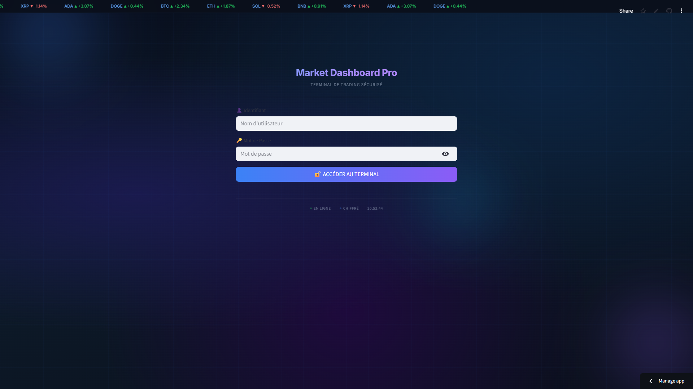
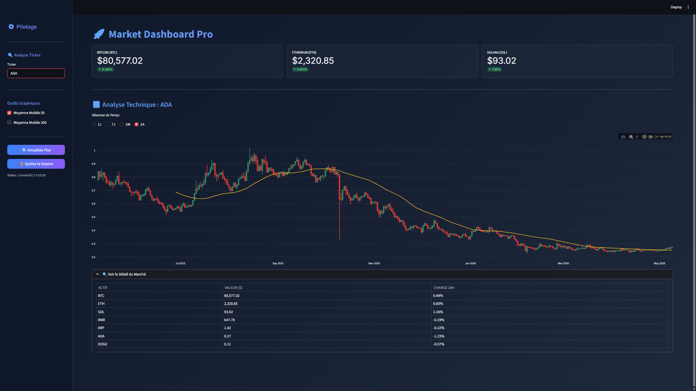

<p align="center">
  
</p>

# 🚀 Market Dashboard Pro

[](https://github.com/aneschebbi6-star/Market_Dashbord)
[](https://www.python.org/)
[](https://streamlit.io/)
[](LICENSE)

**Market Dashboard Pro** est une plateforme de trading et d'analyse de crypto-monnaies haute performance. Conçue avec **Python** et **Streamlit**, elle offre une expérience utilisateur fluide et premium pour le suivi des actifs numériques en temps réel.

---

## ✨ Points Forts

*   **🔐 Authentification de Grade Terminal** : Interface de connexion sécurisée avec un design *glassmorphism* et arrière-plans animés.
*   **📊 Analyse Technique Avancée** : Graphiques en chandeliers (Candlesticks) interactifs propulsés par Plotly, incluant des indicateurs comme MA50 et MA200.
*   **⚡ Flux de Données Ultra-Rapide** : Intégration en temps réel pour BTC, ETH, SOL, et plus via yfinance et CoinGecko.
*   **🔍 Recherche Dynamique** : Analysez instantanément n'importe quel ticker disponible sur le marché mondial.
*   **🎨 UI/UX Premium** : Design moderne, sombre, avec des effets de flou cinétique et des micro-animations.

---

## 📸 Aperçu de l'Interface

<div align="center">
  <table>
    <tr>
      <td width="50%">
        <p align="center"><b>🔐 Connexion Sécurisée</b></p>
        
      </td>
      <td width="50%">
        <p align="center"><b>📊 Dashboard Principal</b></p>
        
      </td>
    </tr>
  </table>
</div>

> [!TIP]
> Pour une expérience optimale, utilisez le navigateur Chrome en mode plein écran.

---

## 🛠️ Installation & Configuration

### Prérequis
*   Python 3.11 ou supérieur
*   Un gestionnaire de paquets (pip)

### Guide Étape par Étape

1.  **Cloner le dépôt**
    ```bash
    git clone https://github.com/aneschebbi6-star/Market_Dashbord.git
    cd Market_Dashbord
    ```

2.  **Configurer l'Environnement Virtuel**
    ```bash
    # Création de l'environnement
    python -m venv venv
    
    # Activation (Windows)
    venv\Scripts\activate
    
    # Activation (Linux/macOS)
    source venv/bin/activate
    ```

3.  **Installer les Dépendances**
    ```bash
    pip install -r requirements.txt
    ```

---

## 🚀 Lancement Rapide

Pour démarrer le terminal de trading, exécutez :

```bash
streamlit run app.py
```

### 🔐 Identifiants par défaut
*   **Utilisateur** : `Anes0123`
*   **Mot de passe** : `chebbi@1`

---

## 🧰 Stack Technique

*   **Frontend & Logic** : [Streamlit](https://streamlit.io/) (Interface réactive)
*   **Visualisation** : [Plotly](https://plotly.com/python/) (Graphiques financiers interactifs)
*   **Data Processing** : [Pandas](https://pandas.pydata.org/) (Manipulation de séries temporelles)
*   **Market Data** : [yfinance](https://github.com/ranaroussi/yfinance) / [CoinGecko API](https://www.coingecko.com/en/api)

---

## 📂 Organisation du Projet

```text
Market_Dashbord/
├── app.py              # Point d'entrée principal (Streamlit UI)
├── fetcher.py          # Logique d'acquisition et traitement des données
├── requirements.txt    # Dépendances du projet
├── assets/             # Ressources (Images, CSS, Logos)
│   ├── banner.png      # Bannière principale
│   └── screenshots/    # Captures d'écran de démonstration
└── README.md           # Documentation complète
```

---

## 🛣️ Roadmap (À venir)

- [ ] 🔔 Alertes de prix personnalisables par email.
- [ ] 🤖 Intégration de signaux de trading basés sur le sentiment (IA).
- [ ] 💼 Gestion de portefeuille (Portfolio Tracking).
- [ ] 🌓 Mode Clair/Sombre automatique.

---

## 🤝 Contribution

Les contributions font la force de la communauté open-source.
1. Forkez le projet.
2. Créez votre branche de fonctionnalité (`git checkout -b feature/AmazingFeature`).
3. Commit avec un message clair (`git commit -m 'Add some AmazingFeature'`).
4. Push sur la branche (`git push origin feature/AmazingFeature`).
5. Ouvrez une Pull Request.

---

## 👤 Auteur

**Anes Chebbi** - *Développeur Fullstack & Passionné de Finance*
- GitHub : [@aneschebbi6-star](https://github.com/aneschebbi6-star)
- LinkedIn : [Votre Profil](https://linkedin.com/in/votre-profil) (Optionnel)

---
<p align="center">Développé avec ❤️ pour la communauté trading.</p>
